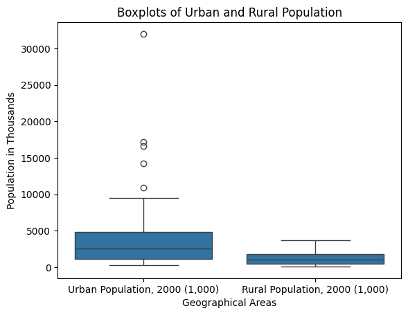
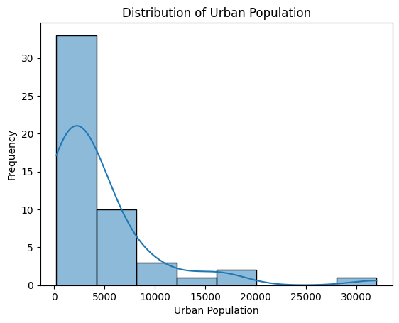

# HW 5 - CS 625, Spring 2025

Bhargav Iyer \
Due: March 23, 2025

## Part 1

Dataset 3 (Urban and Rural Population by State)

### Data Manipulation

```
new_col_names = ['State', 'State Abbreviation', 'Former Urban definition 1990 (percent)', 'Urban definition 1990 (percent)', 'Total Population 2000 (1,000)', 'Urban Population, 2000 (1,000)', 'Urban Population, 2000 percent', 'Rural Population, 2000 (1,000)']
urban.columns = new_col_names
urban = urban.iloc[6:57]
urban = urban.drop(urban[urban['State'] == 'District of Columbia'].index)
```

The data manipulation I did within the data first is to update the column names.  I first updated the column names to what seemed logical and concise names.  I then updated the urban rows to not include any null rows and as well as remove the United States, total from the dataframe.  Finally, I dropped the District of Columbia from the dataframe to only have the bare 50 states datapoints.

### Boxplot



https://colab.research.google.com/drive/1LbZRlMsTFqnWyQtoJ2Sj3NL65ZNSurxH?authuser=0#scrollTo=crsO2iicLJ9P

```
urban_melted = urban[['Urban Population, 2000 (1,000)', 'Rural Population, 2000 (1,000)']].melt(var_name='Geographical Areas', value_name='Population (1,000)')

# Plot the boxplots using Seaborn
sns.boxplot(x='Geographical Areas', y='Population (1,000)', data=urban_melted)
plt.title('Boxplots of Urban and Rural Population')
plt.xlabel('Geographical Areas')
plt.ylabel('Population in Thousands')
```

The above chart was created in Google Colab using seaborn and matplotlib.  I first used the python melt function inorder to change from wide to long format.  The above code creates boxplots using seaborn in order to show the distribution of both Urban and Rural Populations within the 2000s.  I then updated the x and y labels to be Geographical Areas and Population by the thousands respectively.  I added a title to explain what is being shown which is "Boxplots of Urban and Rural Population".

The above chart shows two boxplot glyphs one showing Urban Population distribution and the other showing Rural Population distribution.  The data consists of population counts for the year 2000.  It also uses counts in the thousands (meaning each point should be multiplied by 1000 to get the actual count).

The advantage of using a boxplot for this distribution is due to the

### Histogram



https://colab.research.google.com/drive/1LbZRlMsTFqnWyQtoJ2Sj3NL65ZNSurxH?authuser=0#scrollTo=crsO2iicLJ9P

```
sns.histplot(urban['Urban Population, 2000 (1,000)'], bins=8, kde=True)
plt.title('Distribution of Urban Population')
plt.xlabel('Urban Population')
plt.ylabel('Frequency')
plt.show()
```

### eCDF Chart


https://colab.research.google.com/drive/1LbZRlMsTFqnWyQtoJ2Sj3NL65ZNSurxH?authuser=0#scrollTo=crsO2iicLJ9P

```
sns.ecdfplot(urban['Urban Population, 2000 (1,000)'])
sns.ecdfplot(urban['Rural Population, 2000 (1,000)'])
plt.title('Empirical Cumulative Distribution Functions of Urban and Rural Population')
plt.xlabel('Population')
plt.ylabel('Cumulative Probability')
plt.legend(['Urban Population', 'Rural Population'])
plt.show()
```

## References

*Every report must list the references (including the URL) that you consulted while completing the assignment. Replace the items below with the references you consulted*

* Reference 1, <https://www.digitalocean.com/community/tutorials/pandas-melt-unmelt-pivot-function>
* Reference 2, <https://www.census.gov/library/publications/2010/compendia/statab/130ed/population.html>
