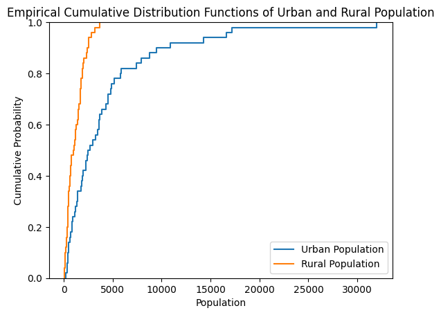
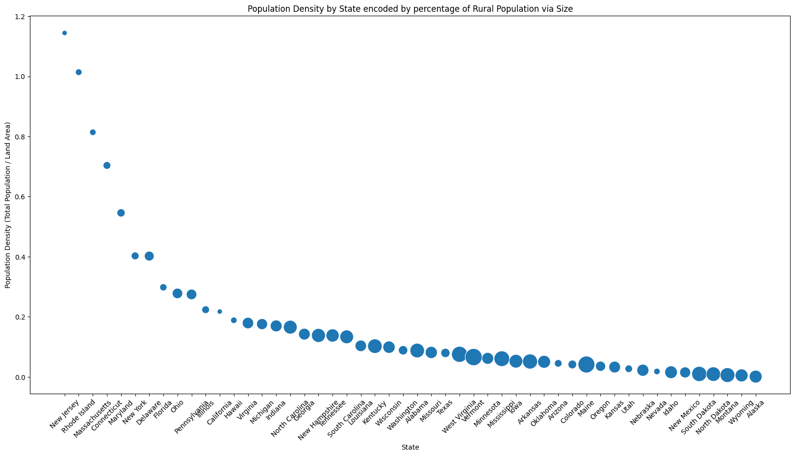

# HW 5 - CS 625, Spring 2025

Bhargav Iyer \
Due: March 23, 2025

## Part 1

Dataset 3 (Urban and Rural Population by State)

### Data Manipulation

```
#Data Manipulation
new_col_names = ['State', 'State Abbreviation', 'Former Urban definition 1990 (percent)', 'Urban definition 1990 (percent)', 'Total Population 2000 (1,000)', 'Urban Population, 2000 (1,000)', 'Urban Population, 2000 percent', 'Rural Population, 2000 (1,000)']
urban.columns = new_col_names
urban = urban.iloc[6:57]
urban = urban.drop(urban[urban['State'] == 'District of Columbia'].index)
urban.info()
urban.head(10)
```

The data manipulation I did within the data first is to update the column names.  I first updated the column names to what seemed logical and concise names.  I then updated the urban rows to not include any null rows and as well as remove the United States, total from the dataframe.  Finally, I dropped the District of Columbia from the dataframe to only have the bare 50 states datapoints.

### Boxplot


https://colab.research.google.com/drive/1LbZRlMsTFqnWyQtoJ2Sj3NL65ZNSurxH?authuser=0#scrollTo=crsO2iicLJ9P

```
#Boxplot
urban_melted = urban[['Urban Population, 2000 (1,000)', 'Rural Population, 2000 (1,000)']].melt(var_name='Geographical Areas', value_name='Population (1,000)')

# Plot the boxplots using Seaborn
sns.boxplot(x='Geographical Areas', y='Population (1,000)', data=urban_melted)
plt.title('Boxplots of Urban and Rural Population')
plt.xlabel('Geographical Areas')
plt.ylabel('Population in Thousands')
```

The above chart was created in Google Colab using seaborn and matplotlib.  I first used the python melt function inorder to change from wide to long format.  The above code creates boxplots using seaborn in order to show the distribution of both Urban and Rural Populations within the 2000s.  I then updated the x and y labels to be Geographical Areas and Population by the thousands respectively.  I added a title to explain what is being shown which is "Boxplots of Urban and Rural Population".

The above chart shows two boxplot glyphs one showing Urban Population distribution and the other showing Rural Population distribution.  The data consists of population counts for the year 2000.  It also uses counts in the thousands (meaning each point should be multiplied by 1000 to get the actual count).

The advantage of using a boxplot for a distribution is that it shows the distribution and outliers within the data.  It is the clearest way to show key statistics within the data.  Also it is easy to compare Urban and Rural population distributions.  Finally, it can easily show any outliers.

The disadvantages of using a boxplot for this dataset is that the dataset is pretty small.  It would hard to determine how many states fall under each quartile.

The insights from the data shows that the amount of population for rural locations are a lot less then urban areas.  Also Rural data seems to not have much variation making it seem most states have a very similar rural population.  This makes sense because of how Rural populations mostly deal with agriculture and will need only a certain amount of people while urban populations depends heavily on what industries are in the city.  Another point to look is that the data seems to show that there are some states that have outliers in the urban locations showing it significantly higher then the rest.

### Histogram


https://colab.research.google.com/drive/1LbZRlMsTFqnWyQtoJ2Sj3NL65ZNSurxH?authuser=0#scrollTo=crsO2iicLJ9P

```
#Histogram
sns.histplot(urban['Urban Population, 2000 (1,000)'], bins=8, kde=True)
plt.title('Distribution of Urban Population')
plt.xlabel('Urban Population')
plt.ylabel('Frequency')
plt.show()
```

The above chart was created in Google Colab using seaborn and matplotlib.  The above code creates a histogram using seaborn in order to show the distribution of Urban Population within the 2000s.  I then updated the x and y labels to be Urban Population and Frequency respectively.  I added a title to explain what is being shown which is "Distribution of Urban and Population".

The above chart shows a histogram of Urban Population distribution.  The data consists of population counts for the year 2000.  It also uses counts in the thousands (meaning each point should be multiplied by 1000 to get the actual count).  The number of bins within the code, I chose was 8.  This was because of how 8 bins seemed to show the general distribution of the data without it becoming too noisy. Using Sturges Rule (Bins=⌈log2(50)+1⌉=⌈6.64+1⌉=8) I found that 8 bins would be the best number.  I used Sturges Rule, because of how it is best for smaller datasets.  I also added a kernel density estimation to estimate a probability density function.  This would make it clear the distribution of the data.

The advantage of using a histogram is that it shows shape of the distribution unlike a boxplot.  The data for Urban populations shows how it is skewed for one side being 0 to 4,900 (4,900,000) having a count of 35 and the larger the Urban population after that the less the count.  This supports what is shown in the boxplot.  Finally it shows trends in the Urban population where the larger the urban population from 4,900,000 the less count it is.

The disadvantage of the histogram with this data is that it is reliant on what a person chooses for their bin size.  If they choose a larger bin size like 20, then the histogram would be noisy on how the distribution would look.  If the bin size is too small then the histogram would look to simple.  Histograms don't show the exact values so if the user chooses a bad bin size, then the counts would obviously be skewed.  For this data, if I increased the bin size then the count specifically for the 0 to 4,900 could be less which might indicate a different distribution.  For histograms it is harder to find outliers.

What I noticed from the histogram is that the data seems to be right-skewed.  The data seems to indicate that Urban populations are more to 0-4,900,000 population count and everything larger than that population count the less the number of states that have that.

### eCDF Chart



https://colab.research.google.com/drive/1LbZRlMsTFqnWyQtoJ2Sj3NL65ZNSurxH?authuser=0#scrollTo=crsO2iicLJ9P

```
#eCDF Plot
sns.ecdfplot(urban['Urban Population, 2000 (1,000)'])
sns.ecdfplot(urban['Rural Population, 2000 (1,000)'])
plt.title('Empirical Cumulative Distribution Functions of Urban and Rural Population')
plt.xlabel('Population')
plt.ylabel('Cumulative Probability')
plt.legend(['Urban Population', 'Rural Population'])
plt.show()
```

The above chart was created in Google Colab using seaborn and matplotlib.  The above code creates an eCDF chart using seaborn in order to show the distribution of Urban and Rural Population within the 2000s.  I then updated the x and y labels to be Population and Cumulative Probability respectively.  I added a title to explain what is being shown which is "Empirical Cumulative Distribution Functions of Urban and Rural Population".

The above chart shows the Empirical Cumulative Distribution for both the Urban Population count and the Rural Population count for the year 2000.  The encoding is using hue to differentiate Urban Population and Rural Population within the 2000s.

The advantage of using eCDF chart is that each datapoint is displayed.  Each states, data is easily shown in the visualization.  Also it is easy to spot outliers.  In this case it is easy to see an outlier in the Urban population data where the outlier is clearly above 30,000 (in thousands) is way farther from the rest of the data.  It is also easy to compare the Rural and the Urban population distributions.

The disadvantage of using eCDF chart is that it is hard to find exact population percentages and summary statistics of the Urban and Rural Populations.

An observation that I noticed is the outliers within the Urban Population Distribution (30,000 in thousands population compared to the other state's urban population).

## Part 2



```
# Calculate Population Density (Population per square mile)
land_urban['Population Density'] = land_urban['Total Population 2000 (1,000)'] / land_urban['Land Area (square miles)']

# Sort states by population density
land_urban = land_urban.sort_values(by='Population Density', ascending=False)

# Ensure the 'Rural Population, 2000 (1,000)' column is numeric
land_urban['Rural Population, 2000 (1,000)'] = pd.to_numeric(land_urban['Rural Population, 2000 (1,000)'], errors='coerce')
land_urban['Total Population 2000 (1,000)'] = pd.to_numeric(land_urban['Total Population 2000 (1,000)'], errors='coerce')

# Handle any zero values in 'Total Population 2000 (1,000)' to avoid division by zero
land_urban['Total Population 2000 (1,000)'] = land_urban['Total Population 2000 (1,000)'].replace(0, 1)  # Replace zeros with 1 for safety

# Calculate the bubble size based on the ratio of Rural Population to Total Population
sizes = (land_urban['Rural Population, 2000 (1,000)'] / land_urban['Total Population 2000 (1,000)']) * 1000  # Scale to make the bubbles reasonable

# Create Bar Plot
plt.figure(figsize=(20, 10))
sns.scatterplot(x=land_urban['State'], y=land_urban['Population Density'], s=sizes)

# Labels and Title
plt.xlabel("State")
plt.ylabel("Population Density (Total Population / Land Area)")
plt.title("Population Density by State encoded by percentage of Rural Population via Size")
plt.xticks(rotation=45)  # Rotate state names for better readability

plt.show()
```

I used another dataset that has the land area of each state.  I wanted to know whether States with a higher rural population tend to have a higher land mass compared to population?  I first removed any unessecary data from that other dataset except for land area and state.  I then removed any trailing or lagging spaces and finally merged the two dataframes together.  I then used y as the Total Population / Land Area and used x as the State Name.  I then encoded using Size in order to show larger rural population percentage means larger total Population per land area.

In the visualization it is clear that the graph is an inverse graph that shows that the less Total Population per Land area signifies more rural percentage.  It also shows that states themselves have an inverse distribution where the Total Population per Land Area decreases in an inverse style.  This would be an interesting thing to further find out more information on why that is the case.

## References

*Every report must list the references (including the URL) that you consulted while completing the assignment. Replace the items below with the references you consulted*

* Reference 1, <https://www.digitalocean.com/community/tutorials/pandas-melt-unmelt-pivot-function>
* Reference 2, <https://www.census.gov/library/publications/2010/compendia/statab/130ed/population.html>
* Reference 3, <https://en.wikipedia.org/wiki/Sturges%27s_rule>
* Reference 4, <https://www.census.gov/library/publications/2010/compendia/statab/130ed/geography-environment.html>
